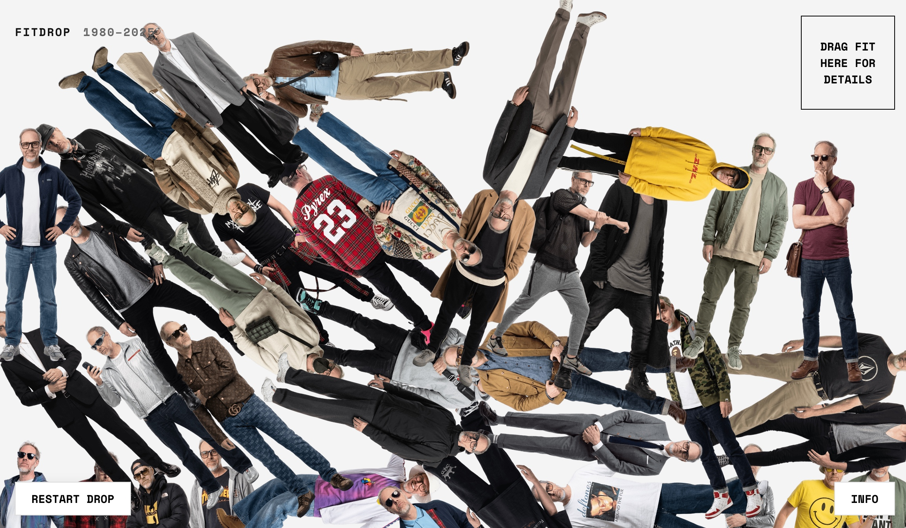
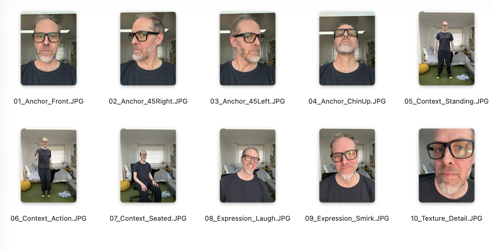

# FITDROP: A Vibe Coding Experiment

FitDrop is a personal exploration of fashion history (1980-2025) and a testament to the speed of AI-assisted prototyping ("Vibe Coding").

This repo is structured to help you understand the process—and potentially "vibe code" your own version.

## The Pipeline

I built this project in a simple, linear pipeline. I'm hoping these instructions are clear enough for you to follow along and create your own version.

### 1. The Data (`data/prompts.json`)
Everything starts with the data. I used Gemini to generate a JSON file containing 45 years of fashion history.
*   **Action**: Edit `data/prompts.json` to define your own "looks" or characters.
*   **Tip**: Use an LLM to generate your own looks into this JSON structure for you. "Give me a set of 'looks' in this JSON format... (obviously have fun with this bit)"

### 2. The Identity (`data/reference_poses/`)
To make the generated images actually look like *someone* (in this case, me), we use "Subject Injection".

*   We don't just use random poses. We use a **Reference Cloud** of 10-15 images of the subject.
*   These images (Anchor, Context, Expression) are fed into Gemini 3.0 Pro to create a semantic cluster of the person's identity.
*   The script (`pipeline/1_generate_images.js`) grabs these from `data/reference_poses/`.
*   **Deep Dive**: Read [IDENTITY_GUIDE.md](IDENTITY_GUIDE.md) for the full theory on "Anthropomorphic Fidelity" and why we structure the data this way.

### 3. The "Shoot" (`pipeline/1_generate_images.js`)
This script acts as our photographer.
*   It reads your `prompts.json`.
*   It sends everything to **Gemini 3.0 Pro** (Image Model).
*   **Run it**: `node pipeline/1_generate_images.js`
*   **Output**: Raw images land in `generated/raw/`.

**WARNING**: Nano Banana Pro is not 'cheap' generating tons of images can rack up costs quite quickly so be careful of autorunning large batches of image generations.

### 4. Cutouts (`pipeline/2_process_cutouts.py`)
We need transparent backgrounds for the physics engine to look real.
*   This script wraps the brilliant `transparent-background` tool.
*   It takes the raw images and automagically removes the background.
*   **Run it**: `python pipeline/2_process_cutouts.py`
*   **Output**: Clean, transparent PNGs are saved directly to `fitdrop_site/images/`.

### 5. The Drop (`fitdrop_site/`)
The interactive playground.
*   Built with **Matter.js** (Physics) and vanilla JS.
*   No heavy frameworks. Just `index.html`, `app.js`, and `styles.css`.
*   **Run it**: `cd fitdrop_site && python3 -m http.server`
*   **Tech Note**: The physics bodies are simple rectangles (1:2.5 aspect ratio) that approximate the human shape. We don't use complex polygon hulls for performance reasons. The transparent PNG is just a texture painted on top of this invisible rectangular block.

---

## How to "Vibe Code" This Yourself

**Prerequisites:**
*   Node.js
*   Python 3.8+
*   A Google Gemini API Key (saved in `.env`)

**Setup:**
1.  **Clone the repo**: Get the code.
2.  **Add your API Key**: Create a `.env` file with `GEMINI_API_KEY=your_key`.
3.  **Install Deps**:
    *   JS: `npm install`
    *   Python: `pip install transparent-background`

**The Workflow:**
1.  **Drop your reference images** into `data/reference_poses/`.
2.  **Define your content** in `data/prompts.json`.
3.  **Generate**: `node pipeline/1_generate_images.js`
4.  **Process**: `python pipeline/2_process_cutouts.py`
5.  **Serve**: Go to `fitdrop_site/` and open it up.

Happy dropping.
